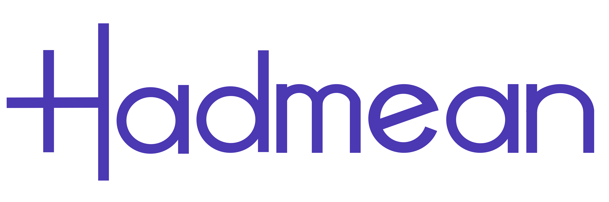

## Introduction
It is often said that a critical ingredient to success lies in one's ability to use tools. There are numerous tools out there to help make your work easier, such as internal tools. But what are they for? Why do you need them? And can you use them effectively to improve your business's performance and operate more efficiently?
<!--truncate-->

The answer is Yes! And that's one of the reasons for building Hadmean, a modern no-code, internal tool generator. Developers tend not to enjoy building internal tools as they are boring and too repetitive. With Hadmean, building admin interfaces and internal apps becomes extremely easy and more importantly fun. However, before delving into all the exciting features and offerings of Hadmean, let us briefly understand internal tools.

## What are internal tools?
Internal tools, also known as admin interfaces, internal software, admin panels, internal apps, admin dashboards, or employee tools, are software created to perform administrative tasks in an organization. These are generally purpose-built to fit an organization's internal operations and processes. They range from data visualization dashboards and CRUD interfaces to your data, lead management systems, and customer support tools.

Internal tools are incredibly vital, and developers invest significant time in developing internal tools, admin panels, and systems for back-office operations to automate and speed up essential business functions. It includes several efforts, ranging from database maintenance to creating various front-end and back-end codes. But what if you could utilize a modern tool to build such applications that help to ease the burden of your work? Sounds good, right? Let's look at how you can also create internal tools that enable business agility.
## What is Hadmean?
Hadmean is an open-source, no-code software that generates admin dashboards, internal apps, and admin panels based on your existing database information. It is fully featured and extremely customizable.

## Why Hadmean?
Most internal tool generators make you build from the ground up i.e you get a blank canvas then you are asked to drag and drop components, and wire them together to satisfy your business requirement. This I believe has many problems.
- They require technical know-how.
- They require some learning curve.
- They require time to build and maintain.
- You duplicate a lot of business logic already in your database.

Hadmean approaches internal tool generation by introspecting your database and building a multi-page application according to all the info it can find, like your field types, relationships, constraints, etc. No JavaScript or SQL is needed to get a fully working application.

## Features
Below are some of the top-rated features of Hadmean that make it the best platform for internal tool generation.

**Easy to install:** Hadmean has one of the easiest installation processes for such a robust tool. It requires just one command `npx hadmean@latest` to get it up and running.

**Easy to use:** There is no technical knowledge required to use Hadmean as it is a visual tool hence there is almost zero learning curve.

**Customizable:** Hadmean is fully customizable, you can turn on/off every feature you see in the UI within the UI.

**Free and Opensource:** Hadmean is freely available and fully open-sourced. Since it is open-source, the source code is available to the public so you can always modify it for your use case however you see fit.

**Language/framework agnostic**: Hadmean is interoperable among various systems. It follows a universal principle that is independent of language specifics.

Technical features include:
- Authentication
- Users management
- Roles and permissions
- CRUD
- Relationships
- Forms validation
- Powerful Filters
- A powerful multi-page navigation system
- Automatic Introspection
- Views
- Intuitive dashboard builder

## Easy steps to build your first internal tool
To get started, you will need to have [Node.js](https://nodejs.org/en/download/). That is the only requirement.

Then run the following command to get it started

```bash
npx hadmean@latest
```
You should now be able to see the application running at [http://locahost:3000](http://locahost:3000) where you will be asked to provide your DB credentials and voila your admin app is fully set up.

[Here](https://hadmean-demo.up.railway.app/) is a link to a demo application built with Hadmean in under 1 minute.

To get a broad overview of how it works, watch a [quick demo](https://github.com/hadmean/hadmean#quick-demo).

You can always refer to the [documentation](https://hadmean.github.io/hadmean/docs/intro) to get the best out of Hadmean and join our [discord server](https://discord.gg/aV6DxwXhzN) to interact with the community.

## Wrapping up
As a final note, this is just the beginning! We are optimistic about what the future holds, with several other exciting features in the pipeline. Hadmean is here to stay, and we'll keep executing and serving our users the latest updates.

Try Hadmean if you haven't already and share it with your friends in the tech space, developers, QA engineers, product managers, CTOs, designers, etc.

Want to get more involved or contribute to the project, see the [open issues](https://github.com/hadmean/hadmean/issues) for a list of proposed features. Any contributions you make will be highly beneficial and appreciated. Get started by reading the [contribution guidelines](https://github.com/hadmean/hadmean/blob/master/docs/CONTRIBUTING.md).

Start building your admin apps with Hadmean today! If you like this project and found this article helpful, please share and leave a star on GitHub.