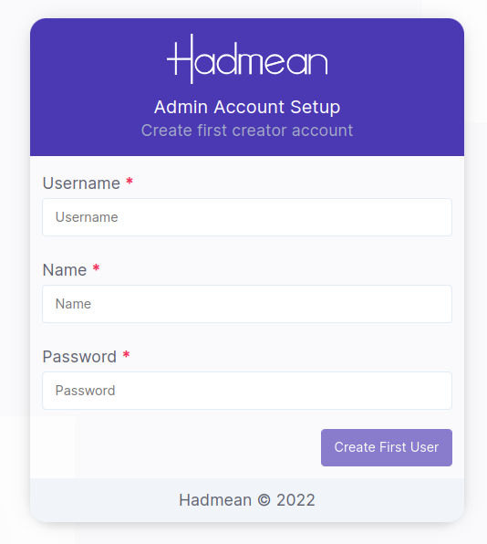

# Setup

You will first need to create a folder to keep all the project artifacts like .env and configuration files and enter the folder.

```bash
mkdir <project_name> && cd <project_name> 
```

After which you will run

```bash
npx hadmean@latest 
```

This is going to pull all the application files for the first time and when next there is an update, so you are always going to be running the latest version of Hadmean at all times.

After pulling the application, the command is also going to spin up the application at [http://locahost:3000](http:localhost:3000)

If running this for the first time for a project, You will be asked to provide your database credentials


Afterward, You will be asked to create your root admin account which will have all the permissions to administrate the app




And you are done with the setup!

:::info
 There is no provision to reset the database credentials or edit it, So creating a new folder and running the setup command is the way to create a new application
:::

:::info
 Running the application for the project is still as simple as running `npx hadmean@latest` in the same folder, There is no other command
:::

As you can see the setup was quite easy and as you might as guessed, there is some magic going on behind the scenes primarily with `.env`. It will be detailed in the next section so that you can edit it to your requirement.
