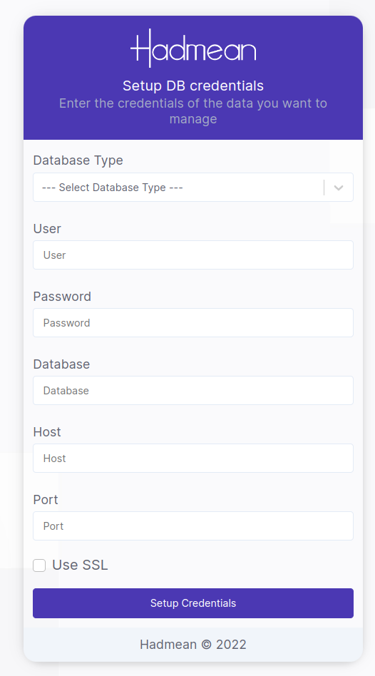

# Setup

You will first need to create a folder to hold the project configurations.

```bash
mkdir <project_name> && cd <project_name> 
```

After which you will run

```bash
npx hadmean@latest 
```

This is going to pull all the application files for the first time and when next there is an update.

:::success
You are always going to be running the latest version of Hadmean at all times.
:::

After `npx hadmean@latest` pulls the application, it will also run it at [http://locahost:3000](http:localhost:3000)

If running this for the first time for a project, You will be asked to provide your database credentials

:::info
Hadmean by default does not write to your database to store configurations as it stores it by default in files. 
You can set it to your database if you desire. More on this in the next section.
:::




Afterward, You will be asked to create your root admin account which will have all the permissions to administrate the app


And you are done with the setup!

:::info
 There is no provision to update your database credentials.
:::

:::info
 Creating a new Hadmean project is as simple as creating a new folder and running `npx hadmean@latest`
:::

:::info
 Running the application again is as simple as running `npx hadmean@latest` in the same folder, There is no other command
:::

As you can see the setup was quite easy and as you might have guessed there is some magic going on behind the scenes primarily with `.env.local`. 

Let's talk about this in the next section.